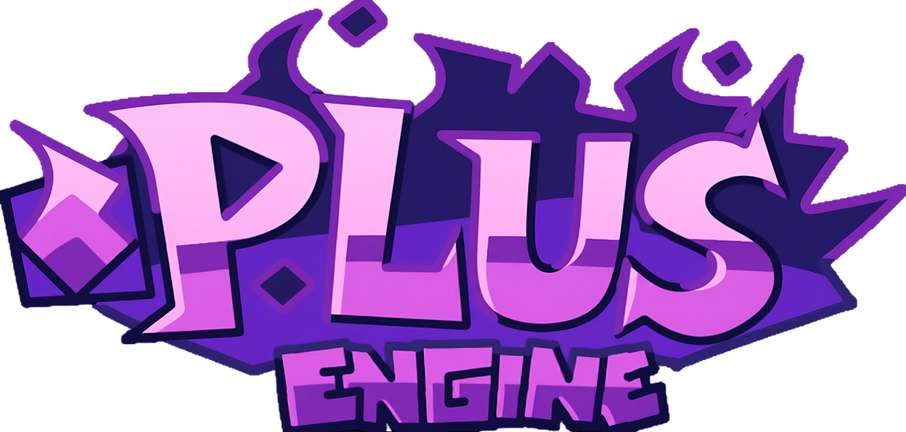
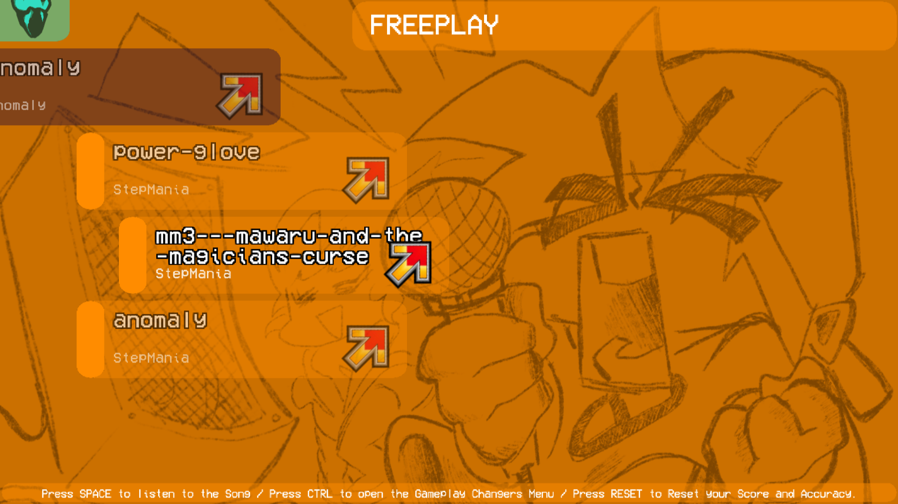
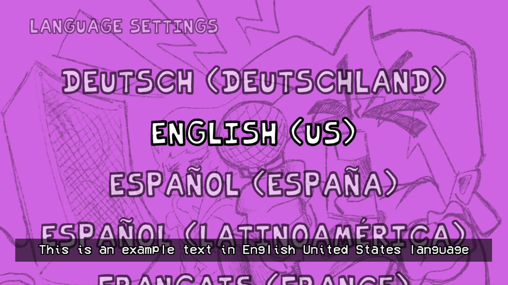
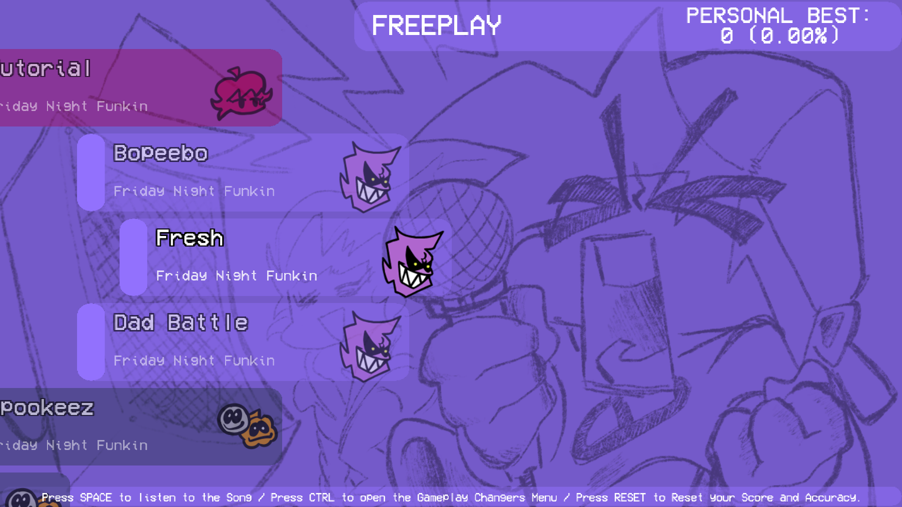
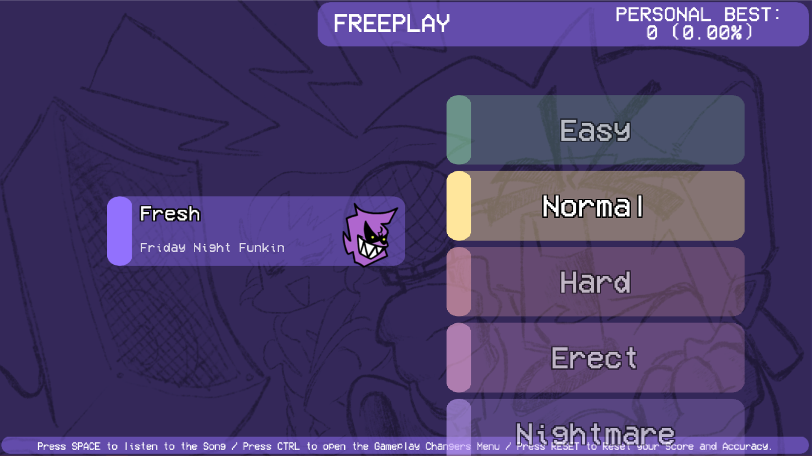
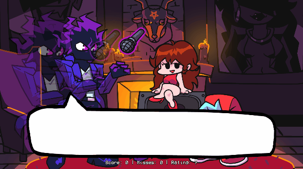
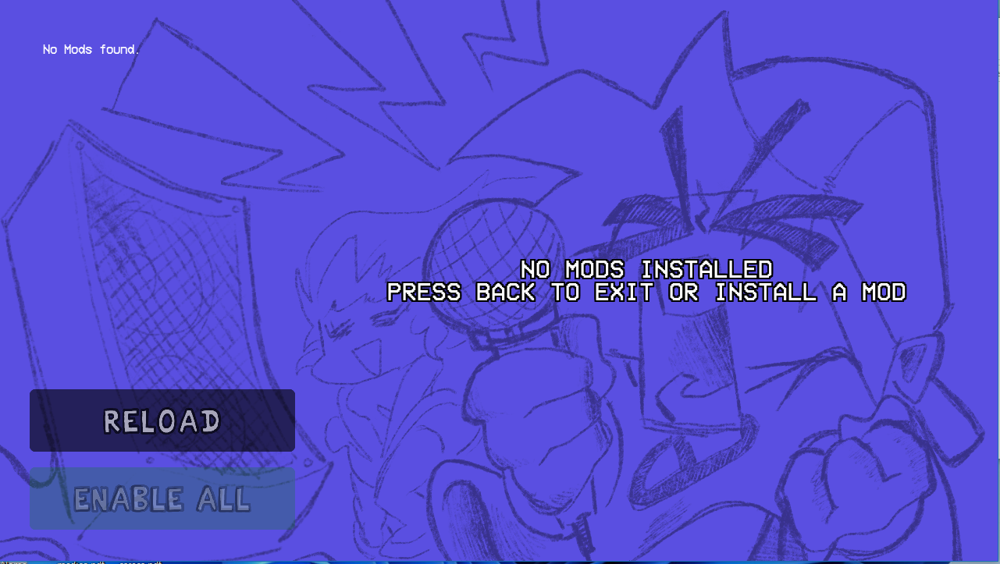
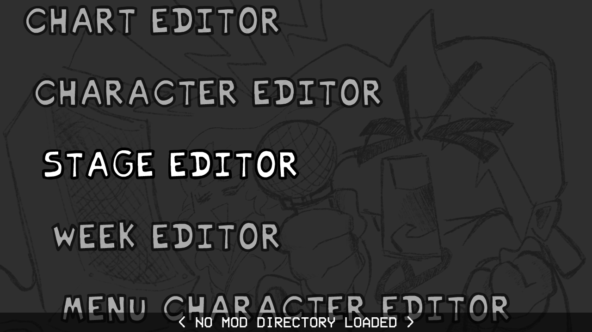

**EN-US | [ES-LA](README.es-LA.md) | [ID-ID](README.id-ID.md)**

Engine based in Psych 1.0.4 with fixes/UIs of [Psych Continued](https://github.com/MeguminBOT/FNF-PsychEngine) and modcharts like NotITG and compatible with hxcodec videos from Psych mods 0.6.3 and 0.7.3.

### Contributors Psych - Plus Engine in general:

<a href="https://github.com/Psych-Plus-Team/FNF-PlusEngine/graphs/contributors">
  
  And 100+ others...
</a>

Made with [contrib.rocks](https://contrib.rocks).

Contributions are welcome! If you have ideas, improvements, or fixes, feel free to fork the repo and open a pull request.

> This project is subject to bugs, fixes, improvements and changes.

# About Code Usage

This project is **open to learn, build, and improve**.
You’re free to use it as a reference, a base, or a learning resource.

Because code is not a buried treasure —
**code lives when it’s shared**.

📚 **Learning > hoarding**
💡 **Sharing > flexing**
🚀 **Building > gatekeeping**

I don’t really believe in the mindset of:
> “Don’t touch my code, don't create other engine, don't use my engine's stuffs, bruh...”

Bro…
**you’re not going to heaven with your private repository under your arm!**

Source code is:
- knowledge
- practice
- mistakes
- evolution

If someone improves something I made, **respect** 🫡
That’s how this has always worked:
learn from the past to build the future.

### ⚠️ Important note
Don’t claim others’ work as your own or sell it as original.
Respect the effort, learn from it, and create something better.

To those who share: thank you 💙
To those who hide code out of fear or envy:
relax — progress doesn’t wait.

**Happy coding.**

## Developer Credits:
* Lenin Asto - Main Programmer for Plus Engine
* sirthegamercoder - Helper Programmer for Plus Engine
* Autistic Lulu - Creator of [Psych Continued](https://github.com/MeguminBOT/FNF-PsychEngine) and author of several UIs and new features for its fork (thanks for letting me use your fork =D)

## Original Credits:
* Shadow Mario - Main Programmer and Head of Psych Engine.
* Riveren - Main Artist/Animator of Psych Engine.

## Mobile Credits:
* Homura - Head Porter of Psych Engine Mobile.
* Karim - Second Porter of Psych Engine Mobile.
* Moxie - Helper of Psych Engine Mobile.

## Special Thanks
* bbpanzu - Ex-Team Member (Programmer).
* crowplexus - HScript Iris, Input System v3, and Other PRs.
* Kamizeta - Creator of Pessy, Psych Engine's mascot.
* MaxNeton - Loading Screen Easter Egg Artist/Animator.
* Keoiki - Note Splash Animations and Latin Alphabet.
* SqirraRNG - Crash Handler and Base code for Chart Editor's Waveform.
* EliteMasterEric - Runtime Shaders support and Other PRs.
* MAJigsaw77 - .MP4 Video Loader Library (hxvlc).
* iFlicky - Composer of Psync, Tea Time and some sound effects.
* KadeDev - Fixed some issues on Chart Editor and Other PRs.
* superpowers04 - LUA JIT Fork.
* CheemsAndFriends - Creator of FlxAnimate.
* Ezhalt - Pessy's Easter Egg Jingle.
* MaliciousBunny - Video for the Final Update.

***

# Build Mobile:
You need to have:

- Android Build Tools / Android Command Line Tools
- Android SDK 36
- Android NDK r27d
- Java JDK 21

# Features after 1.0.4

- Variables for window and system management in Lua: Many variables were added, whether to hide the taskbar or window borders, etc.
- Key Viewer
- Modchart support and settings.

- New Gameplay Changers (Opponent Mode, No Drop Penalty, Perfect Only).
- You can choose your default accuracy system. ITG, Psych, DJMax, Wife3, osu!, Simple
* Support for NotITG levels (without modifiers) and Stepmania, includes UI

- Android support
- Added the "miss" and "combo broken" sprites
- Added the option for "bad" and "shit" to break the combo
- New VideoSprite functionality with optimized hxvlc
- New shader compatibility depending on your graphics card
- Judgement Counter.
- Advanced variables in Lua for the craziest Modcharts.
- New results State and really cool.
- Compatible wth hxcodec videos from Psych mods 0.6.3 and 0.7.3.
- Smooth Health Bar
* +5 Languages availables

- New cool transicioning
- If you are in Charting Mode the step, beat, and section will be displayed in gameplay.
- FPS Counter rework
- Trace in Game
- Rework the OutdatedSubstate.hx
* Rework the FreeplayState.hx

- More things will continue to be added in the future...

# Main Features

## Attractive animated dialogue boxes:

## New Main Menu
* A brand new menu that makes your experience even better!

## Mod Support
* Probably one of the main points of this engine, you can code in .lua files outside of the source code, making your own weeks without even messing with the source!
* Comes with a Mod Organizing/Disabling Menu.

## Atleast one change to every week:
### Week 1:
  * New Dad Left sing sprite
  * Unused stage lights are now used
  * Dad Battle has a spotlight effect for the breakdown
### Week 2:
  * Both BF and Skid & Pump does "Hey!" animations
  * Thunders does a quick light flash and zooms the camera in slightly
  * Added a quick transition/cutscene to Monster
### Week 3:
  * BF does "Hey!" during Philly Nice
  * Blammed has a cool new colors flash during that sick part of the song
### Week 4:
  * Better hair physics for Mom/Boyfriend (Maybe even slightly better than Week 7's :eyes:)
  * Henchmen die during all songs. Yeah :(
### Week 5:
  * Bottom Boppers and GF does "Hey!" animations during Cocoa and Eggnog
  * On Winter Horrorland, GF bops her head slower in some parts of the song.
### Week 6:
  * On Thorns, the HUD is hidden during the cutscene
  * Also there's the Background girls being spooky during the "Hey!" parts of the Instrumental

## Cool new Chart Editor changes and countless bug fixes

* You can now chart "Event" notes, which are bookmarks that trigger specific actions that usually were hardcoded on the vanilla version of the game.
* Your song's BPM can now have decimal values
* You can manually adjust a Note's strum time if you're really going for milisecond precision
* You can change a note's type on the Editor, it comes with five example types:
  * Alt Animation: Forces an alt animation to play, useful for songs like Ugh/Stress
  * Hey: Forces a "Hey" animation instead of the base Sing animation, if Boyfriend hits this note, Girlfriend will do a "Hey!" too.
  * Hurt Notes: If Boyfriend hits this note, he plays a miss animation and loses some health.
  * GF Sing: Rather than the character hitting the note and singing, Girlfriend sings instead.
  * No Animation: Character just hits the note, no animation plays.

## Multiple editors to assist you in making your own Mod

* Working both for Source code modding and Downloaded builds!

## Story mode menu rework:

* Added a different BG to every song (less Tutorial)
* All menu characters are now in individual spritesheets, makes modding it easier.

## Credits menu

* You can add a head icon, name, description and a Redirect link for when the player presses Enter while the item is currently selected.

## Awards/Achievements
* The engine comes with 16 example achievements that you can mess with and learn how it works (Check Achievements.hx and search for "checkForAchievement" on PlayState.hx)

## Options menu:
* You can change Note colors, Delay and Combo Offset, Controls and Preferences there.
 * On Preferences you can toggle Downscroll, Middlescroll, Anti-Aliasing, Framerate, Low Quality, Note Splashes, Flashing Lights, etc.

## Other gameplay features:
* When the enemy hits a note, their strum note also glows.
* Lag doesn't impact the camera movement and player icon scaling anymore.
* Some stuff based on Week 7's changes has been put in (Background colors on Freeplay, Note splashes)
* You can reset your Score on Freeplay/Story Mode by pressing Reset button.
* You can listen to a song or adjust Scroll Speed/Damage taken/etc. on Freeplay by pressing Space.
* You can enable "Combo Stacking" in Gameplay Options. This causes the combo sprites to just be one sprite with an animation rather than sprites spawning each note hit.

#### Psych Engine by ShadowMario, Friday Night Funkin' by ninjamuffin99
